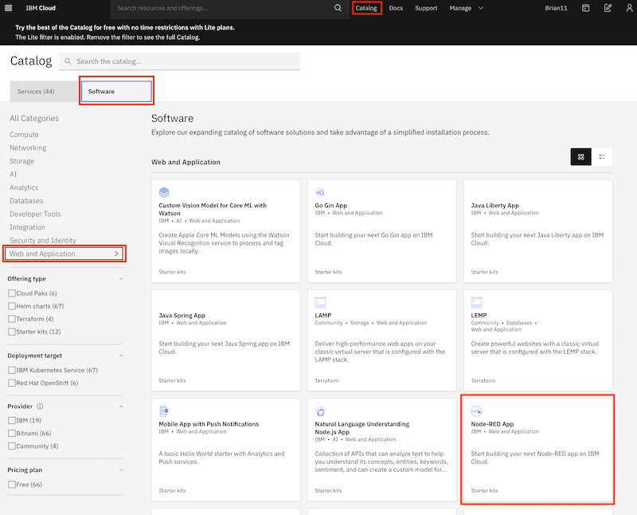
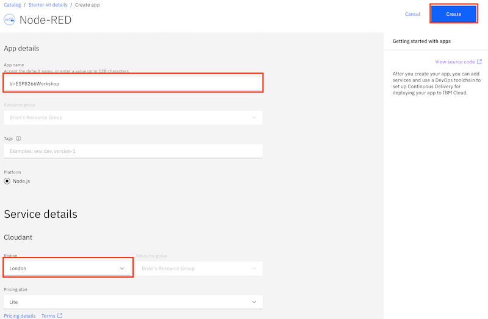
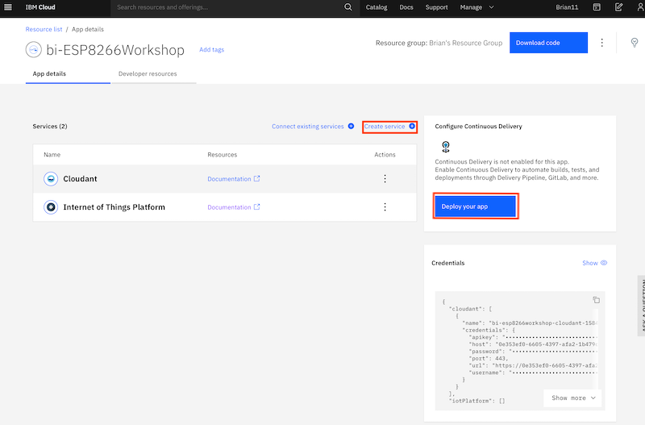
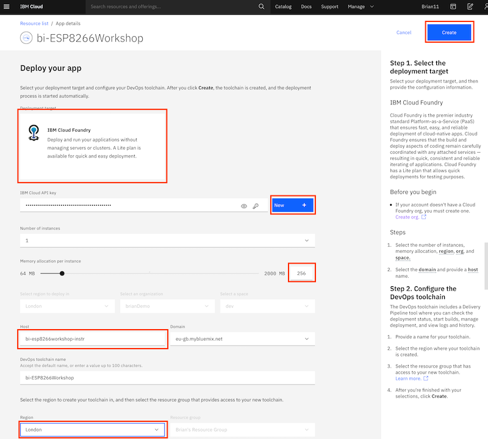
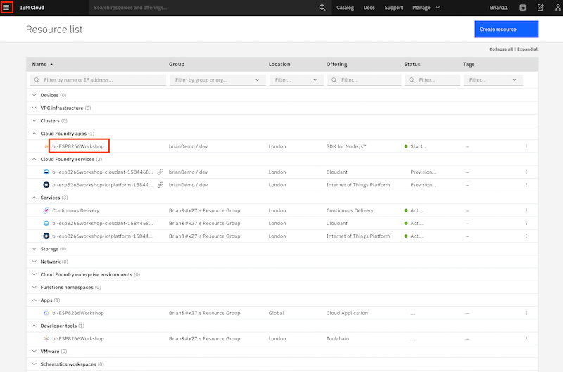
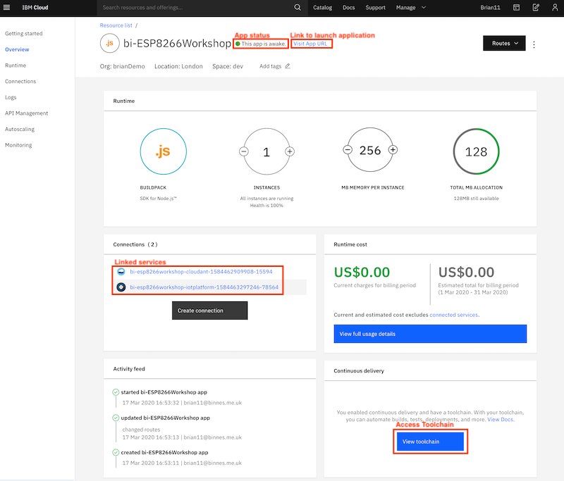

*Quick links :*
***
[Home](/README.md) - [Part 1](/part1/README.md) - [Part 2](/part2/README.md) - [Part 3](/part3/README.md) - [**Resources**](/additionalResources/README.md)
***
**Resources** - [Setup](PREREQUISITES_AND_SETUP.md) - [**IoT Starter App**](IOT_STARTER_APP.md) - [Headerless Setup](HEADERLESS_SETUP.md) - [Command line access](COMMAND_LINE_ACCESS.md)
***

In part 3 you will be working on the IBM cloud.  You will send sensor data aver the mesh network into the IBM Cloud.  The IBM IoT Platform will receive the data over a secure connection, then an application deployed on the cloud will receive the data.

In order to prepare for part 3 you need to deploy a starter application on the cloud and add in the IBM IoT platform service.  Follow the instructions below to complete this.

### Step 1 - Accessing the cloud and selecting an appropriate space

[Login](https://cloud.ibm.com) to your cloud account, if not already logged in.

If you haven't previously used any of the Cloud Foundry locations you will need to create a **space** to be able to work in the chosen location.  To do this from the top menu select *Manage* -> *Account* -> *Cloud Foundry Orgs* then click on your mail address to configure your organisation.  Click to **Add a space** then select the region and provide a name for the space.

If you are working in a lite account you are restricted to a single Cloud Foundry space and are unable to create additional spaces in different regions unless you upgrade your account.

Lite accounts have resource restrictions, so to be able to deploy the starter application you may need to delete any resources already deployed.

### Step 2 - Deploy a Starter Application

- open up the Catalog using the top menu, then select **Web and Applications** from the left menu
- select the **Software** tab
- select the **Node-RED App**

- in the screen presented press the **Create app** button
- in the Create app screen optionally enter an App name (or you can simple accept the name provided) and select a region to deploy the Cloudant NoSQL database to - ideally this should be the same region you have your Cloud Foundry space in.
- press the **Create** button to create the App definition

- wait until the Cloudant service has been deployed
- press the **Create Service +** button, then select the Internet of Things section and press the **Next** button
- select the Internet of Things Platform then press the **Next** button
- choose the closest region, ensure the Lite pricing plan is selected then press Create to add the Internet of Things Platform to your application
- press **Deploy you app**

- ensure IBM Cloud Foundry is the deployment target (this is the only option for lite accounts)
- press **New** to create an IBM Cloud API key, accept the defaults in the popup and press **OK**
- select the Memory allocation per instance to 256 MB
- ensure the host name is valid, if not modify it until any errors are cleared
- select the region closest to you to deploy the toolchain
- press **Create** to generate the toolchain for your application

The Starter Application is now deploying by running the newly created toolchain.

Please leave this to deploy - now is a good time to go for a break or move onto [part 1](../part1/README.md)

### Step 3 - Check deployment status

- open the main menu (Top left of web console UI)
- select Resource list
- select your application from the Cloud Foundry apps section to launch the application overview page

On the overview page you should see:

- the app is awake, which shows the deployment was successful and the application is running
- the link to open the application
- the connections to the Cloudant database and IoT platform services
- link to access toolchain

***
*Quick links :*
***
**Resources** - [Setup](PREREQUISITES_AND_SETUP.md)  - [**IoT Starter App**](IOT_STARTER_APP.md) - [Headerless Setup](HEADERLESS_SETUP.md) - [Command line access](COMMAND_LINE_ACCESS.md)
***
[Home](/README.md) - [Part 1](/part1/README.md) - [Part 2](/part2/README.md) - [Part 3](/part3/README.md) - [**Resources**](/additionalResources/README.md)
