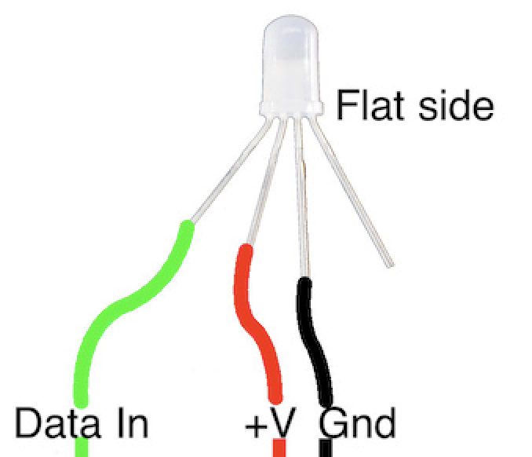

*Quick links :*
***
[Home](/README.md) - [Part 1](/part1/README.md) - [Part 2](/part2/README.md) - [**Part 3**](/part3/README.md) - [Resources](/additionalResources/README.md)
***

# Part 3

## Create an IoT app that sends sensor data over the mesh network

In this Part 3 you will build an Internet of Things application that gathers sensor data and uses the mesh network to send the sensor data to the IBM Cloud. An IBM Cloud app receives and processes the sensor data and sends a command back to a Raspberry Pi to set the color of the RGB LED light attached to the Pi.

In this step, you connect the sensors, install Node-RED and some Node-RED packages, create the IoT app in IBM Cloud, and send the sensor data across the mesh to Watson IoT Platform.

## Learning Objectives

* Connect Sensors
* Install Node-RED and Node-RED packages
* Test the Sensors and LED
* Create an Internet of Things Starter Application in IBM Cloud
* Send sensor data across the mesh to the Watson IoT Platform

## Section 1 - Connect DHT Temperature Sensor and NeoPixel LED to Raspberry Pi

You can attach the DHT temperature and humidity sensor to any Pi that is part of the mesh network or the bridge Pi. Similarly, you can attach the RGB LED to any pi that is part of the mesh network or the bridge Pi. You can attatch the DHT sensor and RGB LED to the same Pi or use different Pis.

### Step 1 - Connect the DHT sensor to your Raspberry Pi

Disconnect the Raspberry Pi from the power supply before connecting the DHT sensor. Depending on the type of DHT sensor that you ordered, there are several ways to connect them.

If your DHT sensors have 4 connecting pins.follow these wiring steps. When looking at the front of the sensor (mesh case) with the pins at the bottom, the connections are (left to right):

* +'ve voltage
* Data
* Not used
* Ground

If you have a DHT mounted on a module then you need to check the pinout, usually indicated on the board, with **+** (to 3V pin), **-** (to G pin) and **out** or **data** :


### Connect the DHT-11

Connect three female to female jumper wires to the DHT-11 and then follow the Raspberry Pi [pinout diagram](https://pinout.xyz/#) to connect the jumpers to the Raspberry Pi:

| DHT | Raspberry Pi |
| --- | --- |
| Ground | Pin 9 |
| Data | Pin 15 |
| 3.3v Power | Pin 17 |

### Step 2 - Connecting the Neopixel to the Raspberry Pi

Now you need to connect the NeoPixel to the Raspberry Pi. Before you start making any connections please disconnect the device from your power supply so there is no power getting to the device. You should never make any connection changes when the device is powered on.

Before making the connections we need to identify the 4 connecting pins coming out of the LED. If you examine the rim of the pixel cover you will see that one side is flattened (this should be the opposite side from the shortest pin) - this pin next to the flattened side is the **Data Out** pin. We will not be using this pin, as we only have a single pixel. You can chain pixels together connecting the **Data Out** pin to the **Data In** pin of the next pixel in the chain.

The shortest pin on the Pixel is the **Data In**
The longest pin on the Pixel is **Ground**
The remaining pin is **+'ve voltage**, which should be 5v, but it works with 3.3v that the Raspberry Pi provides.

So, with the shortest pin on the left and the flat side on the right the pinout is (left to right):

* Data In (shortest pin)
* +'ve Voltage
* Gnd (longest pin)
* Data Out (no connection)

You need to connect the Data In, +'ve voltage and ground to the Raspberry Pi as shown in the diagram. Take care to ensure that the connections are as shown, as connecting the wrong pins can damage the LED:



### Connect the NeoPixel

Connect three female to female jumper wires to the NeoPixel and then follow the Raspberry Pi [pinout diagram](https://pinout.xyz/#) to connect the jumpers to :

| NeoPixel | Raspberry Pi |
| --- | --- |
| Ground | Pin 6 |
| Data | Pin 12 |
| 3.3v Power | Pin 1 |

## Section 2 - Install Node-RED and Node-RED packages

Our next step will be to install packages on the Raspberry Pi(s) with the DHT sensor and RGB LED. The easiest way to connect from your laptop to each of the nodes is to complete the [Bridge Access Point steps](../part2/WIFIBRDG.md) from Part 2.

Determine the IP addresses of each of the Raspberry Pi nodes in your mesh network and use **ssh** to connect to each of them. Install the following packages on each of the Raspberry Pi nodes that you have connected the DHT sensor and RGB LED.

### Install Node.js on your Raspberry Pi

Note: *The DHT sensor install does not yet work with Node.js v12*

These steps detail how to install the Node-RED and node.js packages and some Node-RED prerequisites. The nodered package has a dependency on the nodejs package. The first command will also install the latest nodejs LTS package.

``` plain
sudo apt-get install -y nodered
sudo npm -g install npm
sudo npm -g install node-pre-gyp
sudo npm -g install node-gyp
```

#### node-red-node-pi-neopixel Install instructions

On the Raspberry Pi with the RGB LED attached, install node-red-node-pi-neopixel prerequisites
described in [https://flows.nodered.org/node/node-red-node-pi-neopixel](https://flows.nodered.org/node/node-red-node-pi-neopixel)

* Select to continue (y), but don't perform a full install (N) and don't let it configure sound (N)

``` bash
curl -sS get.pimoroni.com/unicornhat | bash
```

don't reboot the pi just yet, so select N then install the Node-RED node for the neopixel:

``` bash
sudo npm -g install node-red-node-pi-neopixel
```

#### node-red-contrib-dht-sensor DHT Sensor install instructions

On the Raspberry Pi with the DHT sensor attached, follow the BMC2835 install instructions at [http://www.airspayce.com/mikem/bcm2835/index.html](http://www.airspayce.com/mikem/bcm2835/index.html)

``` bash
wget http://www.airspayce.com/mikem/bcm2835/bcm2835-1.62.tar.gz
tar zxvf bcm2835-1.62.tar.gz
cd bcm2835-1.62
./configure
make
sudo make check
sudo make install
```

Finally install node-red-contrib-dht-sensor

``` bash
sudo npm install --unsafe-perm -g node-red-contrib-dht-sensor
```

### Reboot your Raspberry Pi mesh node

Reboot all the Raspberry Pis that have a DHT sensor or RGB LED sensor attached:

``` bash
sudo reboot -n
```

## Section 3 - Test the Sensors and LED

In this section, you will test the sensor readings by creating some simple Node-RED flows. Try to create the flows by following the steps. You can also import the solution flows from github.

### Start Node-RED

Reconnect to each Raspberry Pi with a sensor or LED attached via **ssh**, login and run the following command:

``` bash
node-red
```

Open a browser on your laptop to the IP Address or hostname.local of the desired Raspberry Pi. Node-RED is running on Port 1880 - [http://pi_address:1880](http://pi_address:1880) or [http://hostname.local:1880](http://hostname.local:1880)

### Test the DHT Temperature Sensor by building this flow

Connect your browser to Node-RED running on the raspberry pi with the DHT sensor connected.


#### Flow Instructions

* Select an **Inject** node from the left palette and drag it to your flow canvas.
* Select a **rpi-dht22** node from the palette and drag it to your flow. Double-click on the **rpi-dht22** node. In the Edit dialog, select type of DHT sensor (DHT11 / DHT22) and the Pin number that you have connected the female jumper wire to the Raspberry Pi (Pin 15 suggested above). Press the **Done** button to close the Edit dialog.
* Select a **Debug** node from the palette and drag it to your flow.
* Wire the three nodes as suggested in the screen shot.
* Press the red **Deploy** button.
* To test your flow, click on the tab leading into the **Inject** node.
* Turn to the Node-RED **Debug** right pane by clicking on the little beetle bug icon.
* To test your flow, click on the tab leading into the **Inject** node.

If you are stuck, import this solution flow.

* Open the “Get the Code” github URL listed below, mark or Ctrl-A to select all of the text, and copy the text for the flow to your Clipboard. Click on the Node-RED Menu, then Import, then Clipboard. Paste the text of the flow into the Import nodes dialog and press the red Import button.

  **Get the Code**: [Node-RED DHT Test Flow](flows/dht11-test-flow.json)

### Test the NeoPixel LED by building this flow

Connect your browser to Node-RED running on the raspberry pi with the RGB LED connected.


The NeoPixel Test flow uses **Inject** nodes and **Change** nodes to send RBG color values to the NeoPixel LED. Import this solution flow

  **Get the Code**: [Node-RED NeoPixel Test Flow](flows/neopixel-test-flow.json)

## Section 4 - Create an Internet of Things Starter Application in IBM Cloud

In this section, we will build an application in the IBM Cloud to receive sensor data from our mesh network and remotely control the LED.

First, we need to create an Internet of Things Platform Starter. Follow all of the steps documented in the IBM Developer Tutorial - [Create an Internet of Things Platform Starter application](https://developer.ibm.com/technologies/iot/tutorials/how-to-create-an-internet-of-things-platform-starter-application) and return to this page.

In addition to the Watson IoT platform, the application starter also created a Node-RED instance in the IBM Cloud. This Node-RED application will receive sensor data from the DHT sensor attached to a Raspberry Pi

## Section 5 - Send sensor data across the mesh to the Watson IoT Platform

Before a device can send data to the Watson IoT platform, a device definition needs to to be created in the IoT platform. A device definition is made up of a device type, which is used to group similar devices together, and a devices ID, which uniquely identifies a specific device.

For this demonstration you will create 2 devices, both of the same device type. The first device ID is used to publish DHT data, the second device ID is used to receive commands to set the colour of the RGB LED:

* Device type : **raspi**
* Device ID : **RaspiMeshNode1**
* Device ID : **RaspiMeshNode2**

### Create a Device Instructions

From the IBM Cloud Dashboard, search for and launch the Watson IoT Platform instance that was just created.


Create a Device Type named raspi and a DeviceID named **RaspiMeshNode1**


Then create the second device ID **RaspiMeshNode2**

### Create a Node-RED Flow in the IBM Cloud application

While we're still working in IBM Cloud, let's launch your Internet of Things Starter Application Node-RED flow

Create a flow that will subscribe to the Raspberry Pi Mesh Node sensor MQTT data. As this temperature data arrives, the flow will determine the temperature thresholds and send a command back to the mesh node to change the LED


Import this solution flow

  **Get the Code** : [Node-RED Cloud Send Mesh Alert Flow](flows/cloud-send-mesh-alert-flow.json)

### Create a Node-RED flow to send DHT data to the IBM IoT platform

On the Node-RED running on the Raspberry Pi with the DHT sensor connected. Create a new flow by clicking on the **+** button. Name this flow "Watson IoT". The flow will read DHT Sensor Data and send via MQTT to Watson IoT Platform using the registered device credentials we just created

<TODO - update flow and image>


Import this solution flow

  **Get the Code** : [Node-RED flow to Send Data from the Mesh node and receive Alerts](flows/send-dht-data-2-cloud.json)

### Create a Node-RED Flow on the mesh node to receive LED Alerts

Return to the Node-RED flow on the Raspberry Pi with the RGB LED connected. Create a new flow by clicking on the **+** button. Name this flow "Watson IoT". The flow will subscribe to LED Alerts that are published by the IBM Cloud Node-RED flow. The temperature thresholds were determined in the IBM Cloud and commands are sent subscribed client. The flow will subscribe to these commands and then set the NeoPixel LED to the appropriate colour when a command is received.

<TODO - update flow and image>


Import this solution flow

  **Get the Code** : [Node-RED flow to Send Data from the Mesh node and receive Alerts](flows/receive-command-from-cloud.json)

***
*Quick links :*
***
[Home](/README.md) - [Part 1](/part1/README.md) - [Part 2](/part2/README.md) - [**Part 3**](/part3/README.md) - [Resources](/additionalResources/README.md)

